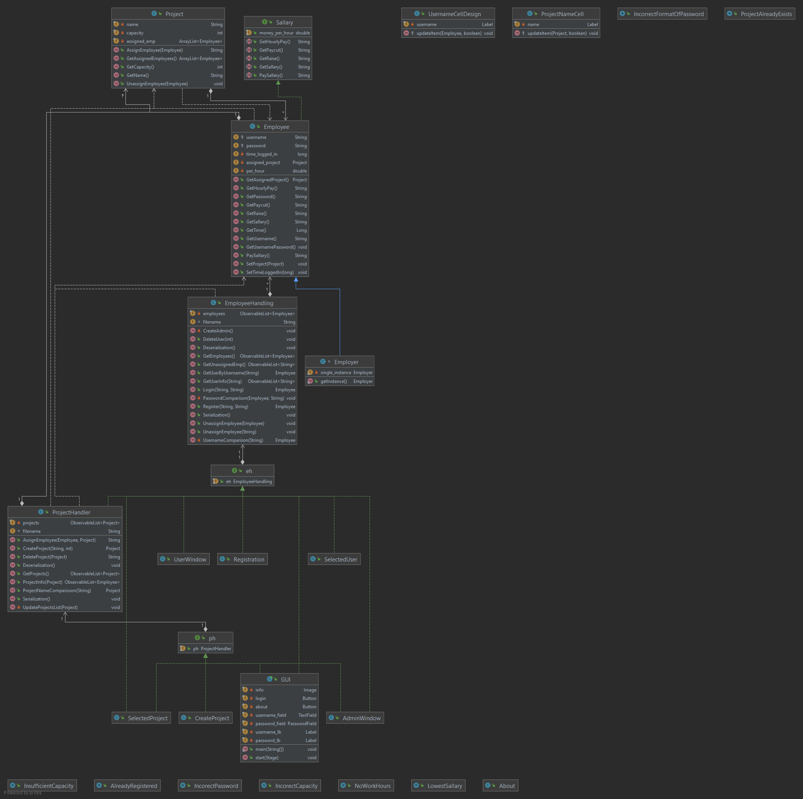

# Peter Koszorús

### Company Manager

### Short project information:	
This project was developed in Java in IntelliJ IDEA IDE using standard libraries

The project is now fully done and functioning you can log in as user and the program will start to count your working hours. When you log in as admin
you will have options to register new employees, delete them, raise their sallary, pay their sallary, give them paycut, create new projects, assign employees to projects, unassign them from projects and also delete the projects.

There is room to further improvement of the program but there is no more time for it. In conclusion I'm happy with the outcome and I learned a lot of new stuff regarding OOP. If I would have to start all over again a would for sure do some stuff differently.

All the specific information on how to use the program will be listed in the readme.me file in the projects directory.

## Environment
- IntelliJ IDEA 2021.1.1 (Ultimate Edition) #IU-211.7142.45, built on April 30 2021, Runtime version: 11.0.10+9-b1341.41 amd64

- SDK 1.8 
- JavaFX 16

## Certain implementations

-I'm using inharitance in the Employee hierarchy also if needed there could be more employee types

-I'm using aggregation in the Employee class when each employee hold the address of Project object instance and also each Project holds list of assigned employee objects

-Polymorphism is used in the employee hierarchy

-I also tried to meet some of the side criterias but these are all mentioned in the Documentation

I devided the project only to three major version: 1.0.0 was the priebezna verzia programu, 1.1.0 was the version where all the employee managament was fully done, 2.0.0 is the final version with the project side of project also fully working 

## Installation

- Project doesn't have any dependencies only the JavaFx which comes as standard with java nowdays.

## Version changes

Version 2.0.0 - Final Version

Version 1.1.0 - User managament fully working

Version 1.0.0 - Priebežná verzia programu

- All the verisons were runnable in Eclipse and IntelliJ on my desktop

## List of features:

Programm is very simple and intuitive to use and has very minimalistic design so it doesn't overwhelm the user.

## Project Skeleton
UML Class Diagram:

